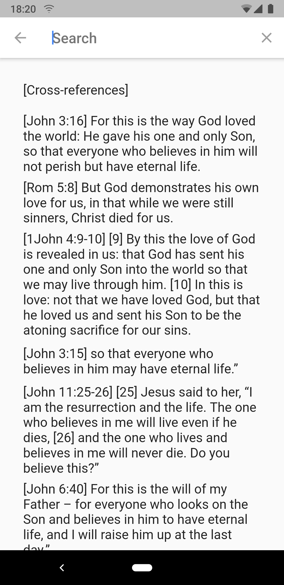
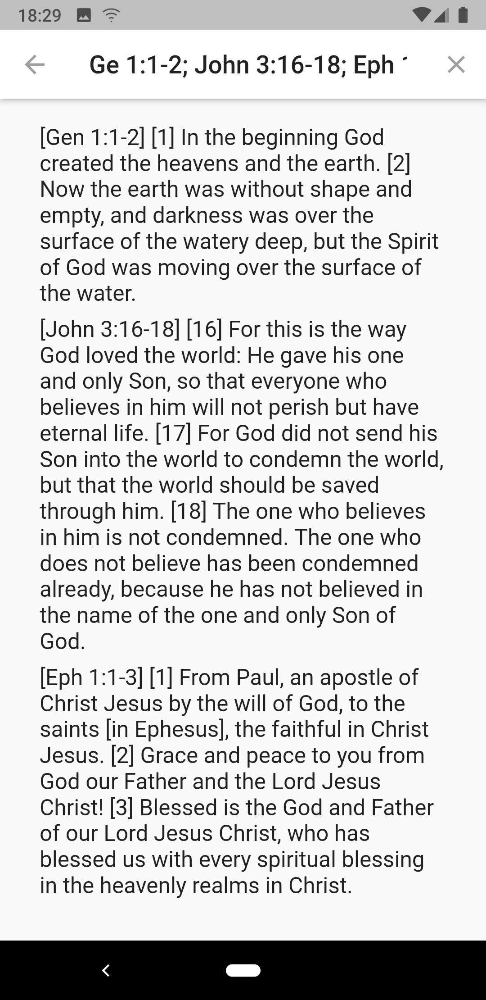
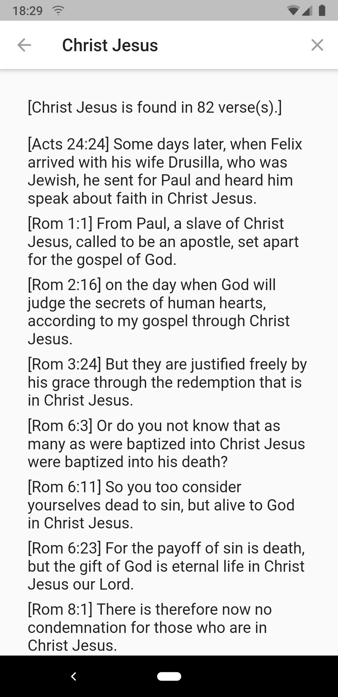
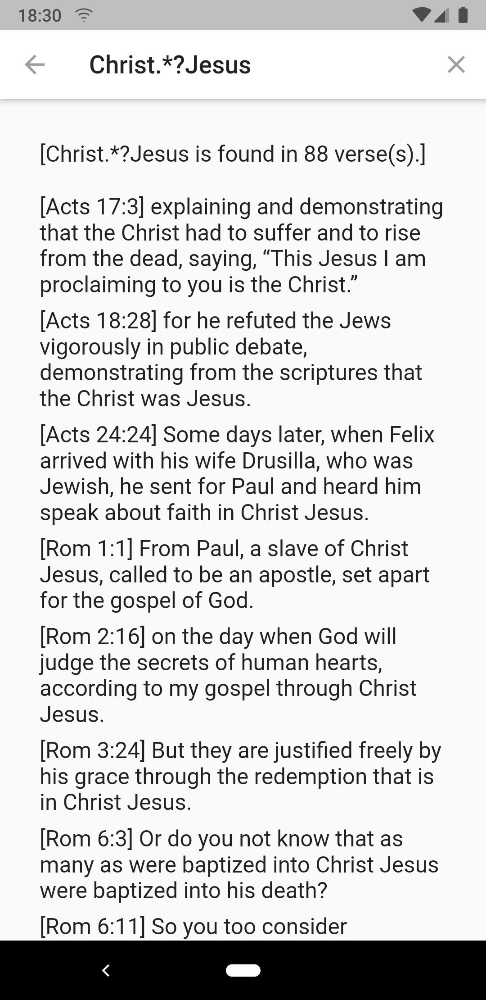
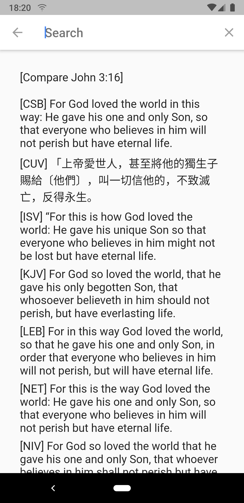
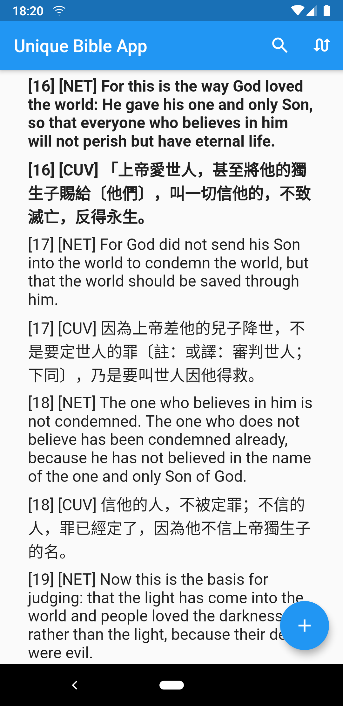

# DartBible-Flutter
Flutter version of the <a href="https://github.com/eliranwong/DartBible">DartBible</a> project; bible tools written in Dart programming language.

Materials in this repository is for building cross-platform apps.
For command-line version, please visit https://github.com/eliranwong/DartBible.

# progress
... adding Hebrew & Greek data
... to be released soon
... updating documents

# screenshots

# other platforms

Full-featured desktop version: https://github.com/eliranwong/UniqueBible

Command-line version: visit https://github.com/eliranwong/DartBible.

For more, visit BibleTools.app
